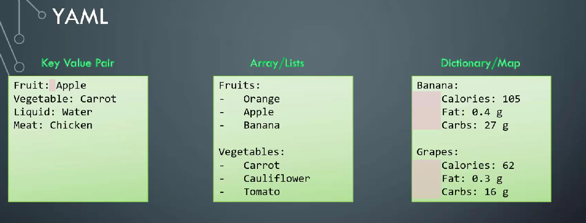
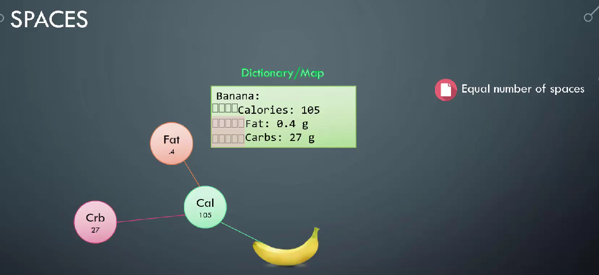
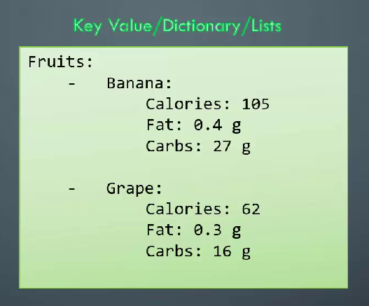
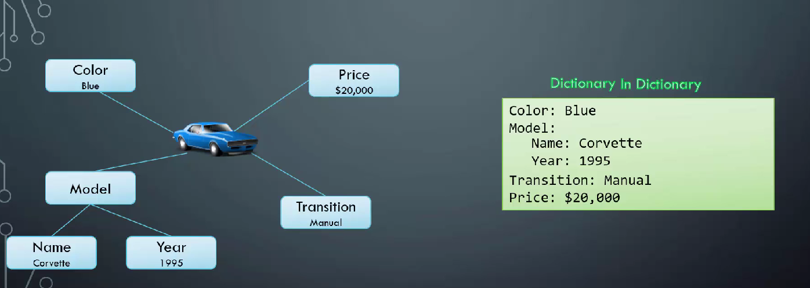
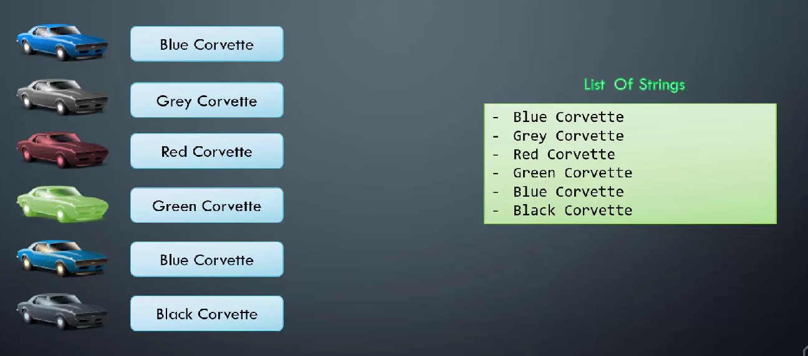
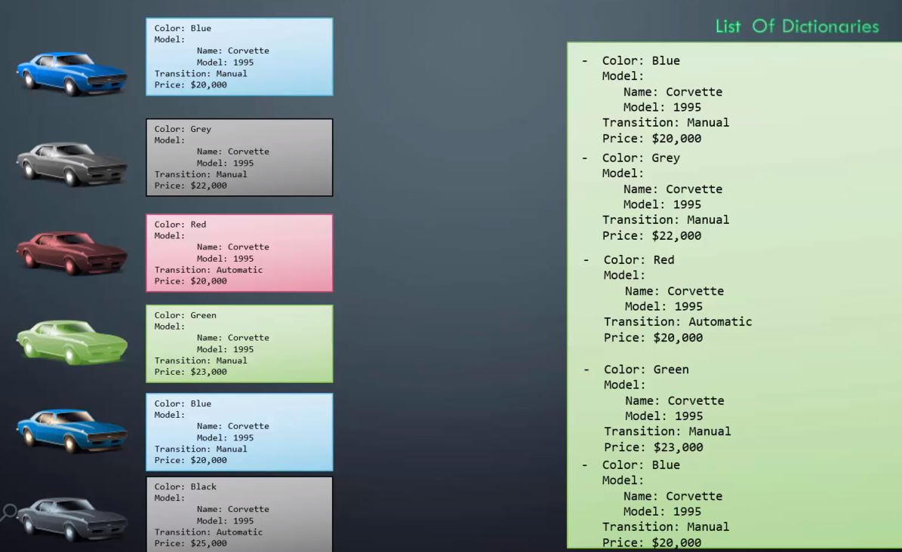
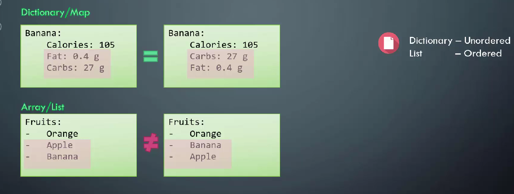

# YAML Syntax
## What is YAML

## YAML

### Spaces Mistake in yaml

### List Containing Dictionaries

### Dictionary in Another Dictionary

### List of String

### List of Dictionaries

### Dictionary VS List

### List of List and a Dictionary:
![]