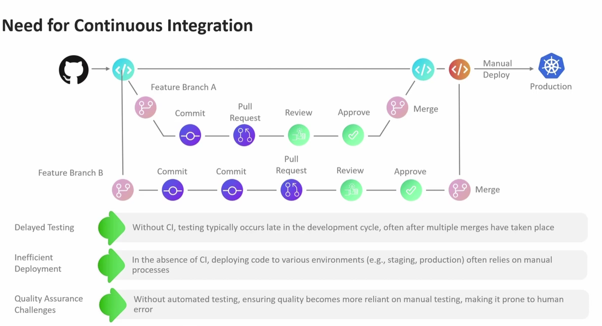
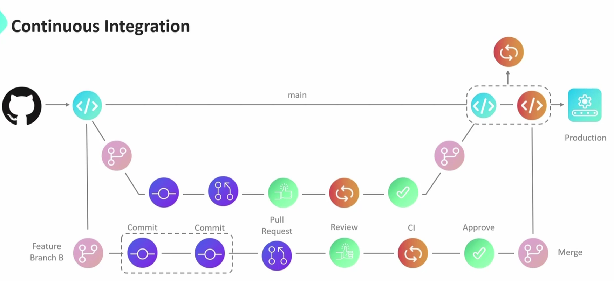
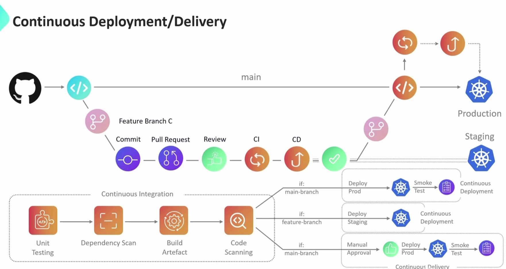

# Github Actions
1. Workflow
2. Job
3. Steps
4. Runner



## Runner
1. Github hosted Runner (vm provided by github, new clean instance, cannot customize runners beyond selecting the type of runner eg. ubuntu, windows, macos, paid, github plans)
2. Self-hosted Runner (self environemnt, vms, multiple runner on same vm)

Why CI/CD:
Feature branch:
commit, pull request, review, approve (merged)

Continous Integration:


live testing before proceeding to production env
CI to CD (non prod/staging)

Continous Deployment/Delivery (CD):


# Actions
steps:
    - uses: actions/checkout@main # @main brance, @v3.6.0 tag, @a324897907 sha

# Multi-Line commands and Executing Third Party Libraries
```yaml
name: My First Workflow

on: [push,fork]

jobs:
    first_job: 
        runs-on: ubuntu-latest
        steps:
            - name: Checkout Repo
              uses: actions/checkout@v4

            - name: List and Read Dockerfile
              run: |
                    echo "My first Github Actions Job"
                    ls -ltra
                    cat Dockerfile
```
Execute multiple jobs in Sequence using needs
use needs syntax

Storing workflow data as artifacts
upload & download artifat

## Variables
env variables at job level, step level
env variables at a workflow level

## workflow_dispatch event
This workflow has a workflow_dispatch event trigger.


## Using Job concurrency
two deployments happening at the same time
concorrency, job level, wokflow level
    concurrency: 
      group:  production-deployment
      cancel-in-progress: true # first workflow will be canceled
      cancel-in-progress: false # wait till the previous job is running

long time workflow -> higher cost

# Timeout for Jobs and Steps:
# Using a matrix for your jobs
multiple jobs for each operating system, each differenct versions for programming languages -> drawbcks, so instead we use matrix
strategy:
      matrix: 
        os: [ubuntu-latest, ubuntu-20.04, windows-latest]
        images: [hello-world, alpine]

if one job is failed, any in progress jobs would fail # default behaviour

strategy:
      fail-fast: false # by default it is true
      max-parallel: 2  # run two jobs at a parralel

exclude:
  - images: alpine
    os: windows-latest
include: 
  - images: amd64/alpine
    os: ubuntu-20.04


# Context
contain information about: secrets, env, variables, 

# Cancelling and Skipping Workflows


# node js project
gitlab.com/solar-system kodekloud project
node install
npm test
echo $? # 0 value, passed

npm run coverage # all the test cases are passed, coverage is 88%, but threshold is 90%
echo  $? # 1, failed

npm start # start the server
localhost:3000

# Using continue on error expression
continue-on-error: true

Using if expressions with Step contexts
id
if: failure() || success()
if: always()

Cache Node Dependencies
Invalidate Cache # changed dependencies
Workflow - Docker Login
Workflow - Docker Build and Test
Workflow - Docker Push

What are Job Containers 

What are Service Containers
