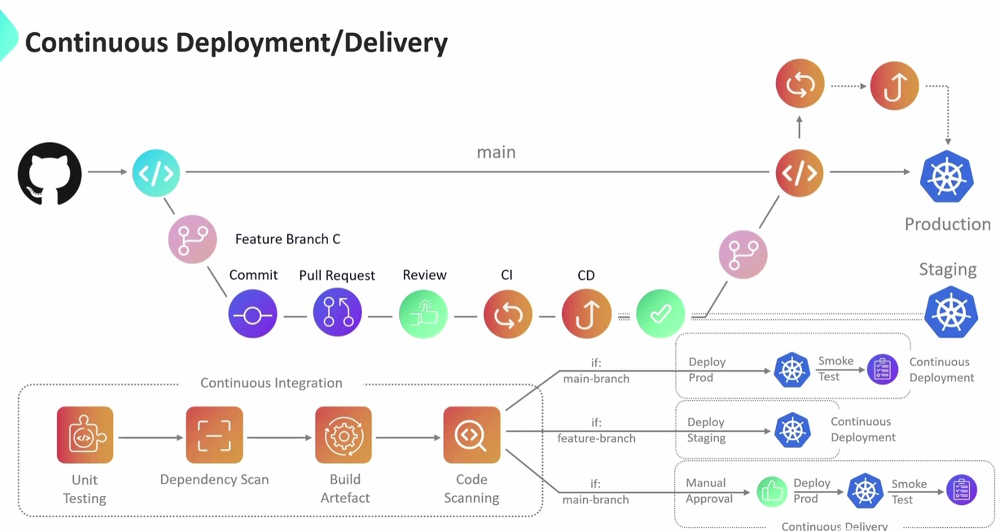

# Github Actions
1. Workflow
2. Job
3. Steps
4. Runner

## Runner
1. Github hosted Runner (vm provided by github, new clean instance, cannot customize runners beyond selecting the type of runner eg. ubuntu, windows, macos, paid, github plans)
2. Self-hosted Runner (self environemnt, vms, multiple runner on same vm)

Why CI/CD:
Feature branch:
commit, pull request, review, approve (merged)

Continous Integration:

live testing before proceeding to production env
CI to CD (non prod/staging)

Continous Deployment/Delivery (CD):
