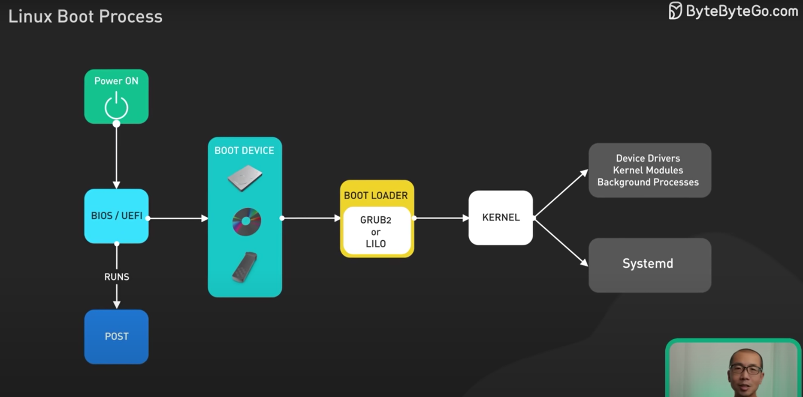

# Linux Boot Process

[Watch the Linux Boot Process Video](https://www.youtube.com/watch?v=XpFsMB6FoOs&ab_channel=ByteByteGo)

## New Commands learnt:
 cat /etc/*release*
 man man
 man 1 printf
 man 2 printf
 apropos director
 apropos -s 1,8 director
 
 ls -lah (l=detail, a=all, h=humand readable format)
 cd / (go to root dir)
 cd - (go to previous dir)
 cd / cd ~ (go to home dir)

 ## Hard link
 ln path_to_target_file path_to_link_file (hard link, point to same inode, only file)

 useradd -a -G family aaron
 useradd -a -G family jane
 chmod 660 /home/aaron/Pictures/family_dog.jpg

 ## Soft Link
 folder to folder, file to file, its a shortcut
 ln -s target_file link_file

 ## Copy with preserve
 `cp --preserve /home/bob/myfile.txt /home/bob/data/myfile.txt`

 ## mov
 do not add -r (recursive) in mov attribute
