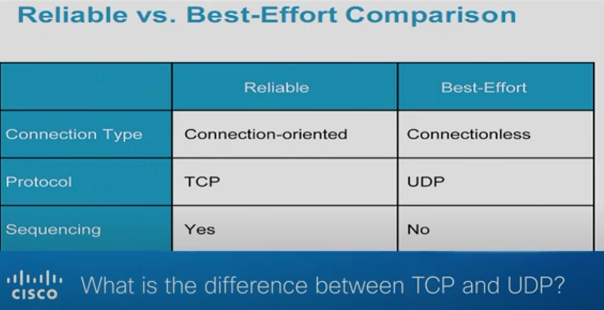

## Networking 
### What Is a Three-Way Handshake in TCP?
https://www.youtube.com/@CiscoSystems

### TCP: 
syn, ack, syn ack
email
file sharing Downloading

### UDP:
user datagram protocol
voice over ip
voice, video call

### UDP Header (DATA)
16-Bit Source Port, 16-Bit Destination Port
16-Bit UDP Length, 16-Bit UDP Checksum 
### TCP & UDP: Comparing Transport Protocols
https://www.youtube.com/watch?v=MMDhvHYAF7E

### Checksum (Layer 2 & 4)
A quick mathematical formula
Document, count the number of E's, List it on the back, don't tell what it means, if the total number of E's match, the document isn't moified

## OSI Model
[OSI and TCP IP Models](https://www.youtube.com/watch?v=3b_TAYtzuho)

- its a reference, guidelines
- Encapsulation (going down in stack, critical for communication), Decapsulation(moving up from Layer 1 to Layer 7)

----------------------------------------------
            Layer 5 to 7, Data
----------------------------------------------
Layer 7: Application      #### | identify 0's and 1's by a file extension e.g, .exe (0's and 1's), .jpeg (0's and 1's to display a picture/color)
Layer 6: Presentation     #### | PDU (protocol data unit)
Layer 5: Session          #### | Data 10010101000011 (really trivial, dont its email, voice, phone, internet, tv)
----------------------------------------------

Layer 4: Transport        #### | identification in networking, application or service, 
