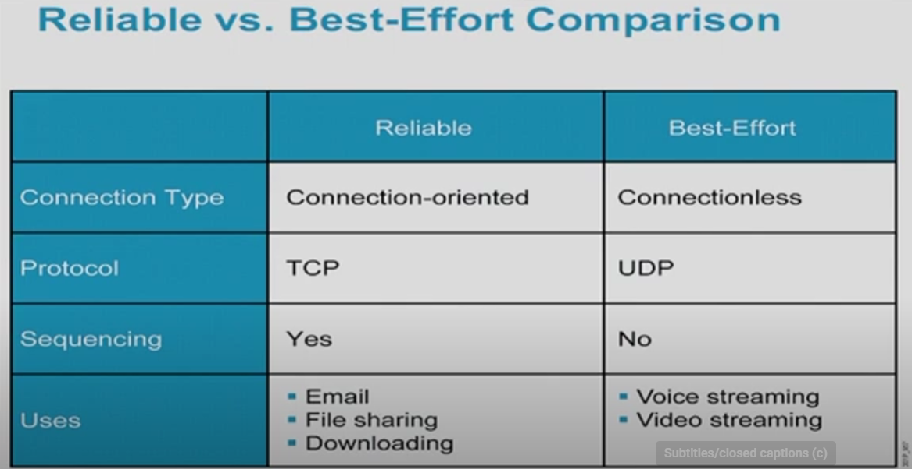

## Networking
### What Is a Three-Way Handshake in TCP?
https://www.youtube.com/@CiscoSystems

### TCP: 
syn, ack, syn ack
email

### TCP & UDP: Comparing Transport Protocols
https://www.youtube.com/watch?v=MMDhvHYAF7E

### Checksum
Document, count the number of E's, List it on the back, don't tell what it means, if the total number of E's match, the document isn't moified
