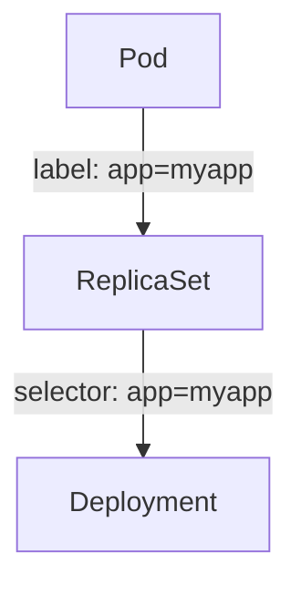
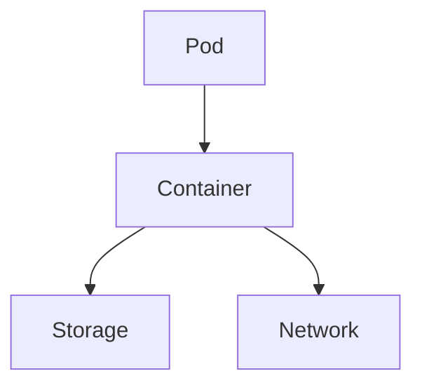
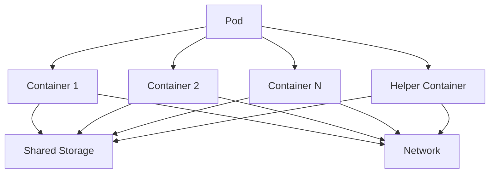

# CKA Certification Course - Certified Kubernetes Administrator
- [CKA preparation](https://learn.kodekloud.com/user/courses/cka-certification-course-certified-kubernetes-administrator)
- CKA Certification link: https://www.cncf.io/certification/cka/

## Core Concepts Section Introduction
## Cluster Architecture

## Table of contents

- [CKA Certification Course - Certified Kubernetes Administrator](#cka-certification-course---certified-kubernetes-administrator)
    - [Core Concepts Section Introduction](#core-concepts-section-introduction)
    - [Cluster Architecture](#cluster-architecture)
    - [Master Node](#master-node)
        - [ETCD cluster](#etcd-cluster)
        - [kube-scheduler](#kube-scheduler)
        - [Controller-Manager](#controller-manager)
        - [Kube-apiserver](#kube-apiserver)
    - [Worker Node](#worker-node)
        - [kubelet](#kubelet-captain-of-the-ship)
        - [kube-proxy](#kube-proxy)
    - [Docker-vs-ContainerD](#docker-vs-containerd)
        - [Docker](#docker)
        - [ContainerD](#containerd)
        - [rkt](#rkt)
    - [A Note on Docker Deprecation](#a-note-on-docker-deprecation)
    - [Pods](#pods)
        - [Pod Diagram](#pod-diagram)
        - [Key Characteristics of Pods](#key-characteristics-of-pods)
        - [Pod Lifecycle](#pod-lifecycle)
        - [Commands and Operations](#commands-and-operations)
        - [Example Pod Configuration](#example-pod-configuration)

---
### Kubernetes Architecture Diagram

 ```mermaid
        graph TD;
            A[Master Node] -->|API Requests| B[Kube-apiserver]
            B --> C[ETCD]
            B --> D[Kube-scheduler]
            B --> E[Controller-Manager]
            A --> F[Worker Node]
            F --> G[kubelet]
            F --> H[kube-proxy]
            F --> I[Pod]
            I --> J[Container]
```

---

## Master Node
1. etcd cluster
2. kube-scheduler
3. Controller-Manager (node-controller, Replication-Controller)
4. kube-apiserver

---

## Worker Node
1. kubelet
2. kube-proxy

---

### ETCD cluster

ETCD is a distributed reliable key-value store that is simple, secure & fast.

#### Key-value store:
- Relational databases vs NoSQL: key-value is NoSQL
- Key-value documents
- JSON or YAML

#### Install ETCD
- Download Binaries
- Extract
- Run ETCD Service

#### Operate ETCD
- Run ETCD Service: `./etcd`
- `./etcdctl set key1 value1`
- `./etcdctl get key1`
- Port: 2379
- `./etcdctl --version` -> utility version & API version

#### ETCD in Kubernetes
- Everything below is changed in etcd server
- Nodes, Pods, Configs, Secrets, Accounts, Roles, Bindings, Others
- Setup: `wget -q --https-only "download_link.tar.gz"`
- Setup - Kubeadm: `kubectl get pods -n kube-system && kubectl exec etcd-master -n kube-system etcdctl get / --prefix -keys-only` (Run inside the etcd-master POD)
- ETCD in HA (High Availability) Environment, there are multiple etcd servers

#### ETCD Commands
```shell
# version 2
etcdctl backup
etcdctl cluster-health
etcdctl mk
etcdctl mkdir
etcdctl set

# version 3
etcdctl snapshot save
etcdctl endpoint health
etcdctl get
etcdctl put

# export etcdctl api of version 3
export ETCDCTL_API=3

# etcd certificates
--cacert /etc/kubernetes/pki/etcd/ca.crt
--cert /etc/kubernetes/pki/etcd/server.crt
--key /etc/kubernetes/pki/etcd/server.key

# final command
kubectl exec etcd-controlplane -n kube-system -- sh -c "ETCDCTL_API=3 etcdctl get / --prefix --keys-only --limit=10 --cacert /etc/kubernetes/pki/etcd/ca.crt --cert /etc/kubernetes/pki/etcd/server.crt --key /etc/kubernetes/pki/etcd/server.key"
```

---
### kube-scheduler

The kube-scheduler determines which pod goes to which node in the Kubernetes cluster.

#### Key Responsibilities:
- Evaluates resource requirements of pods.
- Identifies suitable nodes for pod placement.
- Ensures balanced resource utilization across the cluster.
- Adheres to scheduling policies and constraints.

#### Commands and Operations:
```shell
# View the status of the kube-scheduler
kubectl get pods -n kube-system | grep kube-scheduler

# Check logs of the kube-scheduler
kubectl logs -n kube-system kube-scheduler-<pod-name>

# View kube-scheduler configuration
kubectl describe pod kube-scheduler-<pod-name> -n kube-system
```

#### Configuration:
The kube-scheduler can be configured using a policy file or through the Kubernetes API. Common configurations include setting resource priorities, defining custom scheduling policies, and configuring affinity/anti-affinity rules.

```yaml
# Example of a kube-scheduler policy configuration
apiVersion: kubescheduler.config.k8s.io/v1
kind: KubeSchedulerConfiguration
profiles:
    - schedulerName: default-scheduler
        plugins:
            queueSort:
                enabled:
                    - name: PrioritySort
            preFilter:
                enabled:
                    - name: NodeResourcesFit
            filter:
                enabled:
                    - name: NodeUnschedulable
                    - name: NodeName
            score:
                enabled:
                    - name: NodeResourcesBalancedAllocation
```

---

### Controller-Manager
The Controller-Manager runs controllers that regulate the state of the cluster.

#### Node Controller
Monitors the health of nodes and manages node lifecycle events. It ensures high availability by adding or removing nodes based on resource requirements.

```shell
# Check node status
kubectl get nodes

# View node controller logs
kubectl logs -n kube-system kube-controller-manager-<pod-name>
```

#### Replication Controller vs ReplicaSet
Replication Controller ensures that a specified number of pod replicas are running at any given time. However, it is considered older technology and has been mostly replaced by ReplicaSet, which provides more advanced features.

```yaml
# Example Replication Controller configuration
apiVersion: v1
kind: ReplicationController
metadata:
    name: my-replication-controller
spec:
    replicas: 3
    selector:
        app: myapp
    template:
        metadata:
            labels:
                app: myapp
        spec:
            containers:
            - name: mycontainer
                image: nginx
```

```yaml
# Example ReplicaSet configuration
apiVersion: apps/v1
kind: ReplicaSet
metadata:
    name: myapp-replicaset
    labels:
        app: myapp
        type: front-end
spec:
    template:
        metadata:
            name: myapp-pod
            labels:
                app: myapp
                type: front-end
        spec:
            containers:
            - name: nginx-container
              image: nginx
    
    replicas: 3
    selector:
        matchLabels:
            type: front-end
```
### Labels and Selectors

Labels and selectors are fundamental concepts in Kubernetes that help manage and organize resources.

#### Labels:
Labels are key-value pairs attached to objects, such as pods, to identify attributes. They are used to organize and select subsets of objects.

#### Selectors:
Selectors are used to filter and select objects based on their labels. This is crucial for managing resources like ReplicaSets.

#### Example:
When a pod fails, the ReplicaSet uses labels and selectors to identify and create a new pod based on the template.

```yaml
# Example ReplicaSet configuration
apiVersion: apps/v1
kind: ReplicaSet
metadata:
    name: myapp-replicaset
    labels:
        app: myapp
spec:
    replicas: 3
    selector:
        matchLabels:
            app: myapp
    template:
        metadata:
            labels:
                app: myapp
        spec:
            containers:
            - name: nginx-container
              image: nginx
```

#### Scaling:
To scale the number of replicas from 3 to 6, you can use the following commands:

```shell
# Replace/update the ReplicaSet definition
kubectl replace -f replicaset-definition.yml

# Scale the ReplicaSet using kubectl scale
kubectl scale --replicas=6 -f replicaset-definition.yml
kubectl scale --replicas=6 replicaset myapp-replicaset
```

#### Commands and Operations:
```shell
# Create a Replication Controller
kubectl create -f replication-controller.yml

# Create a ReplicaSet
kubectl create -f replicaset-definition.yml

# View and delete ReplicaSet
kubectl get replicaset
kubectl delete replicaset myapp-replicaset # also deletes all underlying pods

# Edit the replicaset
kubectl edit replicaset new-replica-set

# Scale the ReplicaSet
kubectl scale replicaset myapp-replicaset --replicas=5

# Replace/update and scale
kubectl replace -f replicaset-definition.yml
kubectl scale --replicas=6 -f replicaset-definition.yml
kubectl scale --replicas=6 replicaset myapp-replicaset
```

### High Availability, Load Balancing, and Scaling
Kubernetes ensures high availability and load balancing by distributing workloads across multiple nodes. When resources are exhausted, additional nodes can be added to the cluster.

#### Labels vs Selectors
Labels are key-value pairs attached to objects, such as pods, to identify attributes. Selectors are used to filter and select objects based on their labels.



---

### Kube-apiserver
Primary management component in Kubernetes.

```shell
# Creating a pod via post request
curl -X POST /api/v1/namespaces/default/pods ...[other]

# Creating a pod with kubectl command
kubectl create pod name
```

#### Kube-Api Server does the following:
1. Auth user
2. Validate request
3. Retrieve data
4. Update ETCD
5. Scheduler

```shell
# Installing kube-api server
wget https://storage.googleapis.com/kubernetes-release/release/v1.21.0/bin/linux/amd64/kube-apiserver
kube-apiserver.service

# View api-server - Kubeadm
kubectl get pods -n kube-system
cat /etc/kubernetes/manifests/kube-apiserver.yml
ps -aux | grep kube-apiserver
```

---

## Worker Node
### kubelet (captain of the ship)
Listens for instructions from kube-apiserver.

#### Kubelet working
1. Register Node
2. Create Pods
3. Monitor Node & Pods

---

### kube-proxy
Communication, traffic rules, Pod network, IP of the pod <--> Connectivity.

Service: db (ip10.96.0.12)
Service cannot join the pod network (not an actual thing, only lives in Kubernetes memory).
kube-proxy: process, look for new service, create appropriate rules for each node, iptable rules.

---

## Docker-vs-ContainerD
Docker: dominant due to user-experience.
Docker + Kubernetes (initially) -> only work with Docker.
CRI: Container Runtime Interface - OCI Standard (open container initiative -> imagespec, runtimespec) -> anyone can build container runtime.

### Docker:
Docker doesn't comply with CRI.
rkt: supported by CRI.
dockershim: temporary way to continue to support Docker for runtime.
v1.24: support for Docker removed.
Now Docker followed the imagespec.
Now Docker complies with CRI.

### ContainerD:
Containerd: CRI compatible.
Runtime on its own.
Can work with Kubernetes.
It is a member of CNCF.
Containerd alone can be used if don't need Docker other functions.
CLI - ctr: ctr comes with ContainerD, not very user friendly, only supports limited features.

```shell
ctr
ctr images pull docker.io/library/redis:alpine
ctr run pull docker.io/library/redis:alpine
```

#### ctr utility (ContainerD):
Only used for debugging purposes.
Don't use it.
Limited features.
Not recommended.

#### CLI nerdctl (ContainerD):
Provides a Docker-like CLI for ContainerD.
nerdctl supports Docker Compose.
nerdctl supports newest features in ContainerD:
- Encrypted container images
- Lazy Pulling
- P2P image distribution
- Image signing and verifying
- Namespaces in Kubernetes

```shell
nerdctl
nerdctl run --name redis redis:alpine
nerdctl run --name webserver -p 80:80 -d nginx
```

#### rkt
CRI (Container Runtime Interface).
crictl utility, maintained by Kubernetes community.
Must be installed separately.
Debugging tool - special debugging purposes.
kubectl is unaware of crictl type of images.

```shell
crictl
crictl pull busybox
crictl images
crictl ps -a
crictl exec -i -t 34234345dsfsjklfj ls
crictl logs 3e03423425f1
crictl pods
```

---

## A Note on Docker Deprecation
Why are we still talking about Docker if Docker is deprecated?
- CLI, API, build, volumes, auth, security.

ContainerD was removed from Docker, but Docker is still the most popular container solution.
**--> Kubernetes no longer requires Docker as the runtime.**
It is okay to use Docker as an example.

**--> Replace Docker with nerdctl where applicable.**

---

## Pods

Pods are the smallest, most basic deployable objects in Kubernetes. A Pod represents a single instance of a running process in your cluster.

### Pod Diagram

#### Single Container Pod


#### Multi-Container Pod


---

### Key Characteristics of Pods:
- **Multiple Containers**: A Pod can encapsulate one or more containers.
- **Shared Storage**: Containers in a Pod share storage volumes.
- **Shared Network**: Containers in a Pod share an IP address and port space.

---

### Pod Lifecycle:
1. **Pending**: The Pod has been accepted by the Kubernetes system, but one or more of the container images have not been created.
2. **Running**: The Pod has been bound to a node, and all of the containers have been created.
3. **Succeeded**: All containers in the Pod have terminated successfully.
4. **Failed**: All containers in the Pod have terminated, and at least one container has terminated in failure.
5. **Unknown**: The state of the Pod could not be obtained.

---

### Commands and Operations:
```shell
# Create a Pod
kubectl run mypod --image=nginx

# List all Pods
kubectl get pods

# Describe a Pod
kubectl describe pod mypod

# Delete a Pod
kubectl delete pod mypod
```

---

### Example Pod Configuration:
```yaml
apiVersion: v1
kind: Pod
metadata:
    name: mypod
    labels:
        app: myapp
spec:
    containers:
    - name: mycontainer
        image: nginx
        ports:
        - containerPort: 80
```

```shell
kubectl create -f pod-definition.yml
kubectl get pods
kubectl describe pod myapp-pod

kubectl run nginx-new-pod --image=nginx:latest
kubectl run nginx --image=nginx:latest --dry-run=client -o yaml > pods_dry.yml
```

## Deployments
```markdown
### Create an NGINX Pod

```shell
# Create an NGINX Pod
kubectl run nginx --image=nginx

# Generate POD Manifest YAML file (-o yaml). Don’t create it (–dry-run)
kubectl run nginx --image=nginx --dry-run=client -o yaml
```

### Create a Deployment

```shell
# Create a deployment
kubectl create deployment nginx --image=nginx

# Generate Deployment YAML file (-o yaml). Don’t create it (–dry-run)
kubectl create deployment nginx --image=nginx --dry-run=client -o yaml

# Generate Deployment YAML file (-o yaml). Don’t create it (–dry-run) and save it to a file
kubectl create deployment nginx --image=nginx --dry-run=client -o yaml > nginx-deployment.yaml

# Make necessary changes to the file (for example, adding more replicas) and then create the deployment
kubectl create -f nginx-deployment.yaml

# OR in k8s version 1.19+, we can specify the --replicas option to create a deployment with 4 replicas
kubectl create deployment nginx --image=nginx --replicas=4 --dry-run=client -o yaml > nginx-deployment.yaml
```
```
