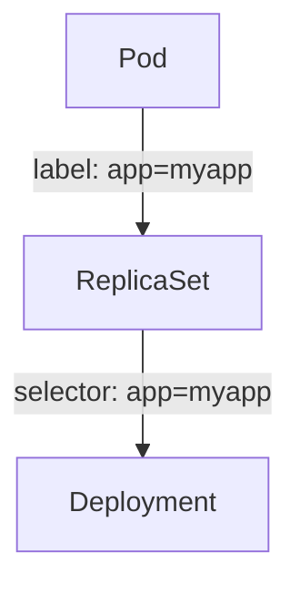
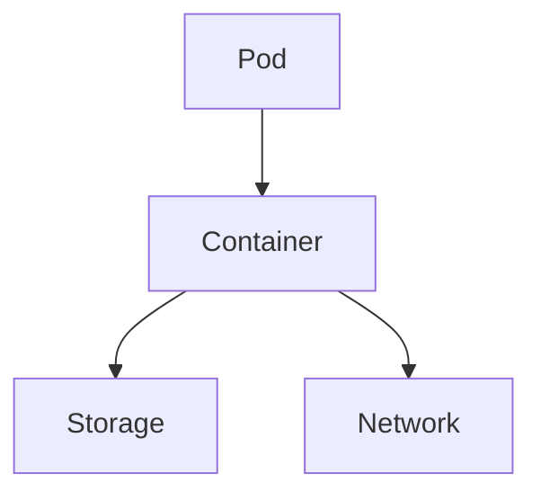
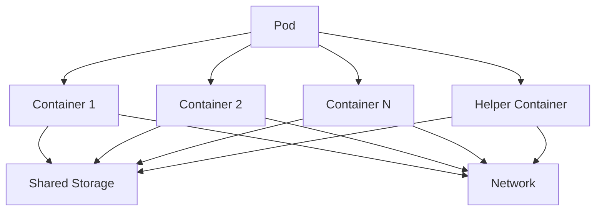

# CKA Certification Course - Certified Kubernetes Administrator
## Imperative vs Declarative

### Imperative Commands
## Core Concepts Section Introduction
## Cluster Architecture

[Notion Notes CKA](https://arkalim.notion.site/Kubernetes-c64b2976b0364cc69864490edef33717)

## Table of contents

- [CKA Certification Course - Certified Kubernetes Administrator](#cka-certification-course---certified-kubernetes-administrator)
    - [Core Concepts Section Introduction](#core-concepts-section-introduction)
    - [Cluster Architecture](#cluster-architecture)
    - [Master Node](#master-node)
        - [ETCD cluster](#etcd-cluster)
        - [kube-scheduler](#kube-scheduler)
        - [Controller-Manager](#controller-manager)
        - [Kube-apiserver](#kube-apiserver)
    - [Worker Node](#worker-node)
        - [kubelet](#kubelet-captain-of-the-ship)
        - [kube-proxy](#kube-proxy)
    - [Docker-vs-ContainerD](#docker-vs-containerd)
        - [Docker](#docker)
        - [ContainerD](#containerd)
        - [rkt](#rkt)
    - [A Note on Docker Deprecation](#a-note-on-docker-deprecation)
    - [Pods](#pods)
        - [Pod Diagram](#pod-diagram)
        - [Key Characteristics of Pods](#key-characteristics-of-pods)
        - [Pod Lifecycle](#pod-lifecycle)
        - [Commands and Operations](#commands-and-operations)
        - [Example Pod Configuration](#example-pod-configuration)

---
### Kubernetes Architecture Diagram

 ```mermaid
        graph TD;
            A[Master Node] -->|API Requests| B[Kube-apiserver]
            B --> C[ETCD]
            B --> D[Kube-scheduler]
            B --> E[Controller-Manager]
            A --> F[Worker Node]
            F --> G[kubelet]
            F --> H[kube-proxy]
            F --> I[Pod]
            I --> J[Container]
```

---

## Master Node
1. etcd cluster
2. kube-scheduler
3. Controller-Manager (node-controller, Replication-Controller)
4. kube-apiserver

---

## Worker Node
1. kubelet
2. kube-proxy

---

### ETCD cluster

ETCD is a distributed reliable key-value store that is simple, secure & fast.

#### Key-value store:
- Relational databases vs NoSQL: key-value is NoSQL
- Key-value documents
- JSON or YAML

#### Install ETCD
- Download Binaries
- Extract
- Run ETCD Service

#### Operate ETCD
- Run ETCD Service: `./etcd`
- `./etcdctl set key1 value1`
- `./etcdctl get key1`
- Port: 2379
- `./etcdctl --version` -> utility version & API version

#### ETCD in Kubernetes
- Everything below is changed in etcd server
- Nodes, Pods, Configs, Secrets, Accounts, Roles, Bindings, Others
- Setup: `wget -q --https-only "download_link.tar.gz"`
- Setup - Kubeadm: `kubectl get pods -n kube-system && kubectl exec etcd-master -n kube-system etcdctl get / --prefix -keys-only` (Run inside the etcd-master POD)
- ETCD in HA (High Availability) Environment, there are multiple etcd servers

#### ETCD Commands
```shell
# version 2
etcdctl backup
etcdctl cluster-health
etcdctl mk
etcdctl mkdir
etcdctl set

# version 3
etcdctl snapshot save
etcdctl endpoint health
etcdctl get
etcdctl put

# export etcdctl api of version 3
export ETCDCTL_API=3

# etcd certificates
--cacert /etc/kubernetes/pki/etcd/ca.crt
--cert /etc/kubernetes/pki/etcd/server.crt
--key /etc/kubernetes/pki/etcd/server.key

# final command
kubectl exec etcd-controlplane -n kube-system -- sh -c "ETCDCTL_API=3 etcdctl get / --prefix --keys-only --limit=10 --cacert /etc/kubernetes/pki/etcd/ca.crt --cert /etc/kubernetes/pki/etcd/server.crt --key /etc/kubernetes/pki/etcd/server.key"
```

---
### kube-scheduler

The kube-scheduler determines which pod goes to which node in the Kubernetes cluster.

#### Key Responsibilities:
- Evaluates resource requirements of pods.
- Identifies suitable nodes for pod placement.
- Ensures balanced resource utilization across the cluster.
- Adheres to scheduling policies and constraints.

#### Commands and Operations:
```shell
# View the status of the kube-scheduler
kubectl get pods -n kube-system | grep kube-scheduler

# Check logs of the kube-scheduler
kubectl logs -n kube-system kube-scheduler-<pod-name>

# View kube-scheduler configuration
kubectl describe pod kube-scheduler-<pod-name> -n kube-system
```

#### Configuration:
The kube-scheduler can be configured using a policy file or through the Kubernetes API. Common configurations include setting resource priorities, defining custom scheduling policies, and configuring affinity/anti-affinity rules.

```yaml
# Example of a kube-scheduler policy configuration
apiVersion: kubescheduler.config.k8s.io/v1
kind: KubeSchedulerConfiguration
profiles:
    - schedulerName: default-scheduler
        plugins:
            queueSort:
                enabled:
                    - name: PrioritySort
            preFilter:
                enabled:
                    - name: NodeResourcesFit
            filter:
                enabled:
                    - name: NodeUnschedulable
                    - name: NodeName
            score:
                enabled:
                    - name: NodeResourcesBalancedAllocation
```

---

### Controller-Manager
The Controller-Manager runs controllers that regulate the state of the cluster.

#### Node Controller
Monitors the health of nodes and manages node lifecycle events. It ensures high availability by adding or removing nodes based on resource requirements.

```shell
# Check node status
kubectl get nodes

# View node controller logs
kubectl logs -n kube-system kube-controller-manager-<pod-name>
```

#### Replication Controller vs ReplicaSet
Replication Controller ensures that a specified number of pod replicas are running at any given time. However, it is considered older technology and has been mostly replaced by ReplicaSet, which provides more advanced features.

```yaml
# Example Replication Controller configuration
apiVersion: v1
kind: ReplicationController
metadata:
    name: my-replication-controller
spec:
    replicas: 3
    selector:
        app: myapp
    template:
        metadata:
            labels:
                app: myapp
        spec:
            containers:
            - name: mycontainer
                image: nginx
```

```yaml
# Example ReplicaSet configuration
apiVersion: apps/v1
kind: ReplicaSet
metadata:
    name: myapp-replicaset
    labels:
        app: myapp
        type: front-end
spec:
    template:
        metadata:
            name: myapp-pod
            labels:
                app: myapp
                type: front-end
        spec:
            containers:
            - name: nginx-container
              image: nginx
    
    replicas: 3
    selector:
        matchLabels:
            type: front-end
```
### Labels and Selectors

Labels and selectors are fundamental concepts in Kubernetes that help manage and organize resources.

#### Labels:
Labels are key-value pairs attached to objects, such as pods, to identify attributes. They are used to organize and select subsets of objects.

#### Selectors:
Selectors are used to filter and select objects based on their labels. This is crucial for managing resources like ReplicaSets.

#### Example:
When a pod fails, the ReplicaSet uses labels and selectors to identify and create a new pod based on the template.

```yaml
# Example ReplicaSet configuration
apiVersion: apps/v1
kind: ReplicaSet
metadata:
    name: myapp-replicaset
    labels:
        app: myapp
spec:
    replicas: 3
    selector:
        matchLabels:
            app: myapp
    template:
        metadata:
            labels:
                app: myapp
        spec:
            containers:
            - name: nginx-container
              image: nginx
```

#### Scaling:
To scale the number of replicas from 3 to 6, you can use the following commands:

```shell
# Replace/update the ReplicaSet definition
kubectl replace -f replicaset-definition.yml
kubectl replace --force -f replicaset-definition.yml

# Scale the ReplicaSet using kubectl scale
kubectl scale --replicas=6 -f replicaset-definition.yml
kubectl scale --replicas=6 replicaset myapp-replicaset
```

#### Commands and Operations:
```shell
# Create a Replication Controller
kubectl create -f replication-controller.yml

# Create a ReplicaSet
kubectl create -f replicaset-definition.yml

# View and delete ReplicaSet
kubectl get replicaset
kubectl delete replicaset myapp-replicaset # also deletes all underlying pods

# Edit the replicaset
kubectl edit replicaset new-replica-set

# Scale the ReplicaSet
kubectl scale replicaset myapp-replicaset --replicas=5

# Replace/update and scale
kubectl replace -f replicaset-definition.yml
kubectl scale --replicas=6 -f replicaset-definition.yml
kubectl scale --replicas=6 replicaset myapp-replicaset
```

### High Availability, Load Balancing, and Scaling
Kubernetes ensures high availability and load balancing by distributing workloads across multiple nodes. When resources are exhausted, additional nodes can be added to the cluster.

#### Labels vs Selectors
Labels are key-value pairs attached to objects, such as pods, to identify attributes. Selectors are used to filter and select objects based on their labels.



---

### Kube-apiserver
Primary management component in Kubernetes.

```shell
# Creating a pod via post request
curl -X POST /api/v1/namespaces/default/pods ...[other]

# Creating a pod with kubectl command
kubectl create pod name
```

#### Kube-Api Server does the following:
1. Auth user
2. Validate request
3. Retrieve data
4. Update ETCD
5. Scheduler

```shell
# Installing kube-api server
wget https://storage.googleapis.com/kubernetes-release/release/v1.21.0/bin/linux/amd64/kube-apiserver
kube-apiserver.service

# View api-server - Kubeadm
kubectl get pods -n kube-system
cat /etc/kubernetes/manifests/kube-apiserver.yml
ps -aux | grep kube-apiserver
```

---

## Worker Node
### kubelet (captain of the ship)
Listens for instructions from kube-apiserver.

#### Kubelet working
1. Register Node
2. Create Pods
3. Monitor Node & Pods

---

### kube-proxy
Communication, traffic rules, Pod network, IP of the pod <--> Connectivity.

Service: db (ip10.96.0.12)
Service cannot join the pod network (not an actual thing, only lives in Kubernetes memory).
kube-proxy: process, look for new service, create appropriate rules for each node, iptable rules.

---

## Docker-vs-ContainerD
Docker: dominant due to user-experience.
Docker + Kubernetes (initially) -> only work with Docker.
CRI: Container Runtime Interface - OCI Standard (open container initiative -> imagespec, runtimespec) -> anyone can build container runtime.

### Docker:
Docker doesn't comply with CRI.
rkt: supported by CRI.
dockershim: temporary way to continue to support Docker for runtime.
v1.24: support for Docker removed.
Now Docker followed the imagespec.
Now Docker complies with CRI.

### ContainerD:
Containerd: CRI compatible.
Runtime on its own.
Can work with Kubernetes.
It is a member of CNCF.
Containerd alone can be used if don't need Docker other functions.
CLI - ctr: ctr comes with ContainerD, not very user friendly, only supports limited features.

```shell
ctr
ctr images pull docker.io/library/redis:alpine
ctr run pull docker.io/library/redis:alpine
```

#### ctr utility (ContainerD):
Only used for debugging purposes.
Don't use it.
Limited features.
Not recommended.

#### CLI nerdctl (ContainerD):
Provides a Docker-like CLI for ContainerD.
nerdctl supports Docker Compose.
nerdctl supports newest features in ContainerD:
- Encrypted container images
- Lazy Pulling
- P2P image distribution
- Image signing and verifying
- Namespaces in Kubernetes

```shell
nerdctl
nerdctl run --name redis redis:alpine
nerdctl run --name webserver -p 80:80 -d nginx
```

#### rkt
CRI (Container Runtime Interface).
crictl utility, maintained by Kubernetes community.
Must be installed separately.
Debugging tool - special debugging purposes.
kubectl is unaware of crictl type of images.

```shell
crictl
crictl pull busybox
crictl images
crictl ps -a
crictl exec -i -t 34234345dsfsjklfj ls
crictl logs 3e03423425f1
crictl pods
```

---

## A Note on Docker Deprecation
Why are we still talking about Docker if Docker is deprecated?
- CLI, API, build, volumes, auth, security.

ContainerD was removed from Docker, but Docker is still the most popular container solution.
**--> Kubernetes no longer requires Docker as the runtime.**
It is okay to use Docker as an example.

**--> Replace Docker with nerdctl where applicable.**

---

## Pods

Pods are the smallest, most basic deployable objects in Kubernetes. A Pod represents a single instance of a running process in your cluster.

### Pod Diagram

#### Single Container Pod


#### Multi-Container Pod


---

### Key Characteristics of Pods:
- **Multiple Containers**: A Pod can encapsulate one or more containers.
- **Shared Storage**: Containers in a Pod share storage volumes.
- **Shared Network**: Containers in a Pod share an IP address and port space.

---

### Pod Lifecycle:
1. **Pending**: The Pod has been accepted by the Kubernetes system, but one or more of the container images have not been created.
2. **Running**: The Pod has been bound to a node, and all of the containers have been created.
3. **Succeeded**: All containers in the Pod have terminated successfully.
4. **Failed**: All containers in the Pod have terminated, and at least one container has terminated in failure.
5. **Unknown**: The state of the Pod could not be obtained.

---

### Commands and Operations:
```shell
# Create a Pod
kubectl run mypod --image=nginx

# List all Pods
kubectl get pods

# List & Watch
kubectl get pods --watch

# List pods with selector
kubectl get pods --selector env=dev

kubectl get pods --selector bu=finance | wc -l

kubectl get pods --selector env=prod,bu=finance,tier=frontend

# Describe a Pod
kubectl describe pod mypod

# Delete a Pod
kubectl delete pod mypod
```

---

### Example Pod Configuration:
```yaml
apiVersion: v1
kind: Pod
metadata:
    name: mypod
    labels:
        app: myapp
spec:
    containers:
    - name: mycontainer
        image: nginx
        ports:
        - containerPort: 80
```

```shell
kubectl create -f pod-definition.yml
kubectl get pods
kubectl describe pod myapp-pod

kubectl run nginx-new-pod --image=nginx:latest
kubectl run nginx --image=nginx:latest --dry-run=client -o yaml > pods_dry.yml
```

## Deployments
```markdown
### Create an NGINX Pod

```shell
# Create an NGINX Pod
kubectl run nginx --image=nginx

# Generate POD Manifest YAML file (-o yaml). Don’t create it (–dry-run)
kubectl run nginx --image=nginx --dry-run=client -o yaml
```

### Create a Deployment

```shell
# Check a deployment
kubectl get deployment

# Create a deployment
kubectl create deployment nginx --image=nginx

# Generate Deployment YAML file (-o yaml). Don’t create it (–dry-run)
kubectl create deployment nginx --image=nginx --dry-run=client -o yaml

# Generate Deployment YAML file (-o yaml). Don’t create it (–dry-run) and save it to a file
kubectl create deployment nginx --image=nginx --dry-run=client -o yaml > nginx-deployment.yaml

# Make necessary changes to the file (for example, adding more replicas) and then create the deployment
kubectl create -f nginx-deployment.yaml

# OR in k8s version 1.19+, we can specify the --replicas option to create a deployment with 4 replicas
kubectl create deployment nginx --image=nginx --replicas=4 --dry-run=client -o yaml > nginx-deployment.yaml
```
## Services

### 1. NodePort
`service-definition.yml`
```yaml
apiVersion: v1
kind: Service
metadata:
  name: myapp-service
spec:
  type: NodePort
  ports:
    - targetPort: 80
      port: 80
      nodePort: 30008
  selector:
    app: my-app
    label: front-end
```

### 2. Cluster IP
`service-definition.yml`
```yaml
apiVersion: v1
kind: Service
metadata:
  name: backend
spec:
  type: ClusterIP # default service
  ports:
    - targetPort: 80
      port: 80
  selector:
    app: my-app
    label: back-end
```

```shell
kubectl create -f service-definition.yml
kubectl get service
```

### 3. LoadBalancer
```yaml
apiVersion: v1
kind: Service
metadata:
    name: myapp-loadbalancer
spec:
    type: LoadBalancer
    ports:
        - port: 80
            targetPort: 80
    selector:
        app: my-app
```

```shell
kubectl create -f loadbalancer-service-definition.yml
kubectl get service
```
## Namespaces

Namespaces in Kubernetes are used to divide cluster resources between multiple users. They provide a way to create multiple virtual clusters within the same physical cluster.

### Fully Qualified Domain Name (FQDN) for Services

In Kubernetes, services can be accessed using their Fully Qualified Domain Name (FQDN). The FQDN for a service includes the service name, namespace, and cluster domain.

For example:
- Service name: `db-service`
- Namespace: `dev`
- Cluster domain: `svc.cluster.local`

The FQDN for the `db-service` in the `dev` namespace would be:
```
db-service.dev.svc.cluster.local
```

### Creating a Namespace

To create a namespace, you can use the following command:
```shell
kubectl create namespace dev
```

### Using a Namespace

To create resources within a specific namespace, specify the namespace in the resource definition or use the `--namespace` flag with `kubectl` commands.

#### Example Pod Definition in a Namespace:
```yaml
apiVersion: v1
kind: Pod
metadata:
    name: mypod
    namespace: dev
spec:
    containers:
    - name: mycontainer
        image: nginx
```

#### Using `kubectl` with a Namespace:
```shell
# List all namespaces
kubectl get ns

kubectl get pods -n=finance
kubectl get pods --all-namespaces
kubectl get pods -A | grep blue

# Create a Pod in the 'dev' namespace
kubectl create -f pod-definition.yml --namespace=dev

kubectl create deployment redis-deploy --image=reids --replicas=2 --namespace=dev-ns

# Run a Redis Pod in the 'finance' namespace
kubectl run redis --image=redis --namespace=finance

# Get Pods in the 'dev' namespace
kubectl get pods --namespace=dev
```

### Setting the Context for a Namespace

To avoid specifying the namespace in every command, set the default namespace for your `kubectl` context:
```shell
kubectl config set-context --current --namespace=dev
```

### Compute Resource Quotas

Resource quotas limit resource consumption per namespace. Example resource quota definition:
```yaml
apiVersion: v1
kind: ResourceQuota
metadata:
    name: compute-quota
    namespace: dev
spec:
    hard:
        requests.cpu: "1"
        requests.memory: 1Gi
        limits.cpu: "2"
        limits.memory: 2Gi
```

To create and view the resource quota:
```shell
kubectl create -f compute-quota.yml
kubectl get resourcequota --namespace=dev
```
## Imperative vs Declarative

### Imperative Commands

Imperative commands are used to perform specific actions step by step. They are useful for quick tasks and one-off changes.

```shell
# Create a Pod imperatively
kubectl run nginx --image=nginx

# Expose a Pod as a service
kubectl expose pod nginx --port=80 --target-port=80

# Scale a deployment
kubectl scale deployment nginx --replicas=3

# Delete a Pod
kubectl delete pod nginx
```

### Declarative Configuration

Declarative configuration involves defining the desired state of the system using configuration files. Kubernetes will ensure that the actual state matches the desired state.

```yaml
# pod-definition.yml
apiVersion: v1
kind: Pod
metadata:
    name: nginx
spec:
    containers:
    - name: nginx
        image: nginx
```

```shell
# Apply the configuration file
kubectl apply -f pod-definition.yml

# View the current state
kubectl get pods

# Update the configuration file and reapply
kubectl apply -f pod-definition.yml

# Delete the resource using the configuration file
kubectl delete -f pod-definition.yml
```

## Certification Tips - Imperative Commands with Kubectl
```yml
kubectl run nginx --image=nginx # Create an NGINX Pod
kubectl run custom-nginx --image=nginx --port=8080 # create a pod with port
kubectl run ngiinx --image=nginx --dry-run=client -o yaml # Generate POD Manifest YAML file (-o yaml). Don’t create it(–dry-run)

kubectl create deployment --image=nginx nginx # create a deployment
kubectl create deployment --image=nginx nginx --dry-run=client -o yaml # just genrate yml

kubectl create deployment nginx --image=nginx --replicas=4 # with 4 replicas
kubectl scale deployment nginx--replicas=4 # also scale via command
kubectl create deployment nginx --image=nginx --dry-run=client -o yaml > nginx-deployment.yaml # modify scaling

kubectl expose pod redis --port=6379 --name redis-service --dry-run=client -o yaml # service, cluster ip
kubectl expose pod nginx --type=NodePort --port=80 --name=nginx-service --dry-run=client -o yaml # nodeport

kubectl create service nodeport nginx --tcp=80:80 --node-port=30080 --dry-run=client -o yaml
# Both the above commands have their own challenges. While one of them cannot accept a selector, the other cannot accept a node port. I would recommend going with the
kubectl expose

kubectl run redis --image=redis:alpine --dry-run=client -oyaml > redis-pod.yaml # modify and add label
kubectl run redis -l tier=db --image=redis:alpine
References:
https://kubernetes.io/docs/reference/generated/kubectl/kubectl-commands
https://kubernetes.io/docs/reference/kubectl/conventions/
```
## Kubectl Apply Command
## Taints and Tolerations
kubectl taint nodes node-name key=value:taint-effect
noSchedule, prefernoscheule, notexecute
kubectl taint nodes node...
kubectl taint nodes model app= blue: NOschedule
value needs to encoded in double quotes "" in a yml file, pod-definition.yml
kubectl describe node kubemaster | grep Taint

kubectl taint nodes <node-name> key=value:taint-effect

# untaint:
kubectl taint nodes controlplane node-role.kubernetes.io/control-plane:NoSchedule-

## labeling nodes
kubectl label nodes <node-name> <label-key>=<label-value>
kubectl label nodes node-1 size=Large
## Node Selectors
```yml
apiVersion: v1
kind: Pod
metadata:
 name: myapp-pod
spec:
 containers:
 - name: data-processor
   image: data-processor
 nodeSelector:
  size: Large
```
### Node Affinity
```yml
# Please edit the object below. Lines beginning with a '#' will be ignored,
# and an empty file will abort the edit. If an error occurs while saving this file will be
# reopened with the relevant failures.
#
# deployments.apps "blue" was not valid:
# * patch: Invalid value: "map[spec:map[template:map[spec:map[affinity:map[nodeAffinity:map[requiredDuringSchedulingIgnoreDuringExecution:map[nodeSelectorTerms:[map[matchExpressions:[map[key:color operator:In values:[blue]]]]]]]]]]]]": strict decoding error: unknown field "spec.template.spec.affinity.nodeAffinity.requiredDuringSchedulingIgnoreDuringExecution"
#
apiVersion: apps/v1
kind: Deployment
metadata:
  annotations:
    deployment.kubernetes.io/revision: "1"
  creationTimestamp: "2025-01-04T17:07:21Z"
  generation: 1
  labels:
    app: blue
  name: blue
  namespace: default
  resourceVersion: "1606"
  uid: dbbbf20b-e1f4-443d-a525-72de5b423973
spec:
  progressDeadlineSeconds: 600
  replicas: 3
  revisionHistoryLimit: 10
  selector:
    matchLabels:
      app: blue
  strategy:
    rollingUpdate:
      maxSurge: 25%
      maxUnavailable: 25%
    type: RollingUpdate
  template:
    metadata:
      creationTimestamp: null
      labels:
        app: blue
    spec:
      affinity:
        nodeAffinity:
          requiredDuringSchedulingIgnoredDuringExecution:
            nodeSelectorTerms:
              - matchExpressions:
                - key: color
                  operator: In
                  values:
                    - blue
      containers:
      - image: nginx
        imagePullPolicy: Always
        name: nginx
        resources: {}
        terminationMessagePath: /dev/termination-log
        terminationMessagePolicy: File
      dnsPolicy: ClusterFirst
      restartPolicy: Always
      schedulerName: default-scheduler
      securityContext: {}
      terminationGracePeriodSeconds: 30
status:
  availableReplicas: 3
  conditions:
  - lastTransitionTime: "2025-01-04T17:07:28Z"
    lastUpdateTime: "2025-01-04T17:07:28Z"
    message: Deployment has minimum availability.
    reason: MinimumReplicasAvailable
    status: "True"
    type: Available
  - lastTransitionTime: "2025-01-04T17:07:21Z"
    lastUpdateTime: "2025-01-04T17:07:28Z"
    message: ReplicaSet "blue-6dc9b889f5" has successfully progressed.
    reason: NewReplicaSetAvailable
    status: "True"
    type: Progressing
  observedGeneration: 1
  readyReplicas: 3
  replicas: 3
  updatedReplicas: 3

```
## Resource Limits
CPU: 1
Mem: 1Gi

0.1cpu = 100m (mili)
```yml
apiVersion: v1
kind: Pod
metadata:
  name: simple-webapp-color
  labels:
    name: simple-webapp-color
spec:
 containers:
 - name: simple-webapp-color
   image: simple-webapp-color
   ports:
    - containerPort:  8080
   resources:
     requests:
      memory: "1Gi"
      cpu: "1"
```
OOM (out of memory) error

### Limit Ranges
```yml
apiVersion: v1
kind: LimitRange
metadata:
  name: cpu-resource-constraint
spec:
  limits:
  - default:
      cpu: 500m
    defaultRequest:
      cpu: 500m
    max:
      cpu: "1"
    min: 
      cpu: 100m
    type: Container
```
### Resource Quotas
at namespace level

## DaemonSets
daemonsets are like replicaset
whenever a new nod is added, one copy of the pod is always present in all nodes
replica of pod in all the nodes of the cluster
kubeproxy can be deployed as a daemonset in the cluster
networking solution: weave-net
`kubectl get daemonsets`

how does it work:
nodeName: node01, nodeName: node02 -> old k8s version
new version: use node affinity

### Create daemonset
to create daemonset, first generate deployment yml file by running: 
` kubectl create deployment elasticsearch --image=registry.k8s.io/fluentd-elasticsearch:1.20 -n kube-system --dry-run=client -o yaml > fluentd.yaml`
then add kind: DeamonSet and remove replica and spec.strategy filed from yml file and apply
`kubectl apply -f daemonset.yml

## Static Pods
Master: controller-manager.yml, apiserver.yml, etcd.yml (/etc/kubernetes/manifests)
Static Pods vs DaemonSets
default path: /etc/kubernetes/manifests/

cat /var/lib/kubelet/config.yaml -> configuration file located here
check for: staticPodPath: /etc/just-to-mess-with-you

## Multiple Schedulers
kubectl get serviceaccount -n kube-system

## Which scheduler is picked up:
kubectl get events -o wide
kubectl logs my-custom-scheduler --name-space=kube-system

pod-definition.yaml
```yml
apiVersion: v1
kind: Pod
metadata:
  name: ngnix
spec:
  containers:
  - image: nginx
    name: ngnix
  
  schedulerName: my-custom-scheduler
```
kubectl create -f pod-definition.yaml

## 28. Solution Multiple Scheduler:
kubectl get sa my-scheduler -n kube-system

#### Q4: config map
cat /root/my-scheduler-config.yaml
```yml
apiVersion: kubescheduler.config.k8s.io/v1beta2
kind: KubeSchedulerConfiguration
profiles:
  - schedulerName: my-scheduler
leaderElection:
  leaderElect: false 
```
kubectl create configmap my-scheduler-config --from=/root/my-scheduler-config.yaml -n kube-system
kubectl get configmap my-schedule-config -n kube-system

### Q5:
kubectl get pods -A 
kubectl describe pod kube-scheduler-controlplane # get an image, put it in the provided sheduler.yaml file
kubectl create -f my-scheduler.yaml
kubectl get pods -n kube-system

### Q6: create a pod with a new custom scheduler
```yml
apiVersion: v1
kind: Pod
metadata:
  name: ngnix
spec:
  containers:
  - image: nginx
    name: ngnix
  
  schedulerName: my-custom-scheduler
```
kubectl create -f ngninx-pod.yaml

### 29. Configuring Scheudler Profiles
#### Priority class:
```yml
apiVersion: scheduling.k8s.io/v1
kind: Priorityclass
metadata:
  name: high-priority
value: 1000000
globalDefault: false 
description: "This priority class should be used for XYZ service pods only."
```
highest priority pods placed at the beginning of the queue in (Scheding Queue)
plugins:
  - Schedulaing Queue
  - Filtering
  - Scoring 
  - Binding

Extension Points
### Scheduler profiles
Add multiple schedulars as a profiles in sheduler configuration file

### 29-A Extra 2025: Admission controllers
kube-apiserver -h | grep enable-admission-plugins

### 29-B Extra 2025: Admission Controllers validating
Mutating admission controllers VS validating admission controls (NamespaceAutoProvision)

MutatingAdmission Webhook VS ValidatingAdmission Webhook

Admission Webhook Server:
```shell
kubectl -n webhook-demo create secret tls webhook-server-tls \
    --cert "/root/keys/webhook-server-tls.crt" \
    --key "/root/keys/webhook-server-tls.key"
```
## Application Lifecycle management
2. Rollout and Versioning
kubectl rollout history deployment/myapp-deployment # shows revision history

### Deployment Strategies
1. recreate (down time expected)
2. RollingUpdate (default)

### Rollback:
kubectl get replicasets
kubectl rollout undo deployment/myapp-deployment # destroy new and live old

#### create:
kubectl create -f deployment.yml

#### Get:
kubectl get deployments

#### Update:
kubectl apply -f deployment.yml
kubectl set image deployment/myapp-deployment ngnix=nginx:1.9.1

#### Status:
kubectl rollout history deployment/myapp-deployment

#### Rollback:
kubectl rollout undo deployment/myapp-deployment

#### Set a new image
kubectl set help
kubectl set image deploy frontend simple-wbapp=kodekloud/webapp-color:v3

## Applicaiton Commands
### Command and Arguments in a docker
Containers are not meant to host OS (Operating Systems)
docker run ubuntu 
docker run ubuntu sleep 5 # hard coded 
docker run ubuntu-sleeper 10 -> ENTRYPOINT ["sleep"]
docker run ubuntu-sleeper -> gave error
docker run ubuntu-sleeper -> ENTRYPOINT ["sleep"] CMD ["5"]
docker run --entrypoint sleep2.0 ubuntu-sleeper 10 # overrite
d
### Command and Arguments in a Kubernetes Cluster
```yml
apiVersion: v1
kind: Pod
metadata:
  name: ubuntu-sleeper-pod
spec:
  containers:
  - name: ubuntu-sleeper
    image: ubuntu-sleeper
    command: ["sleep2.0"] # ENTRYPOINT
    args: ["10"] # CMD
```
kubectl create -f pod-definition.yaml

## configmap
secrets, hashed secrets

## Mutli Container Pod

### sidecar container 
In Kubernetes, a sidecar container is a container that starts before the main application container and continues to run.
### Init Container
An initContainer is configured in a pod like all other containers, except that it is specified inside a initContainers section,  like this:
```yml
apiVersion: v1
kind: Pod
metadata:
  name: myapp-pod
  labels:
    app: myapp
spec:
  containers:
  - name: myapp-container
    image: busybox:1.28
    command: ['sh', '-c', 'echo The app is running! && sleep 3600']
  initContainers:
  - name: init-myservice
    image: busybox
    command: ['sh', '-c', 'git clone <some-repository-that-will-be-used-by-application> ; done;']
```
If any of the initContainers fail to complete, Kubernetes restarts the Pod repeatedly until the Init Container succeeds.

## Backup and Restore - ETCD Cluster
kubectl get all --all-namespaces -o yaml > all_deployed_services.yml


ETCDCTL_API=3 etcdctl  --data-dir /var/lib/etcd-from-backup \
snapshot restore /opt/snapshot-pre-boot.db

## multi node clusters
```yml
    1  kubectl get nodes
    2  kubectl config get-configs
    3  kubectl config -h
    4  kubectl config get-clusters
    5  kubectl config view
    6  kubectl config get-contexts
    7  kubectl config use-context cluster1
    8  kubectl get nodes
    9  kubectl config use-context cluster2
   10  kubectl get nodes
```
ETCDCTL_API=3 etcdctl --endpoints 192.168.57.6:2379   \
--cert=/etc/kubernetes/pki/etcd/server.crt  \
--key=/etc/kubernetes/pki/etcd/server.key   \ 
--cacert=/etc/kubernetes/pki/etcd/ca.crt    \
snapshot save /opt/cluster1.db

2022-03-25 09:19:27.175043 I | mvcc: restore compact to 2552
2022-03-25 09:19:27.266709 I | etcdserver/membership: added member 8e9e05c52164694d [http://localhost:2380] to cluster cdf818194e3a8c32
root@controlplane:~#

## Security 
stattic user auth file, auth token file, and service accounts for bots
### TLS certificates 
Private key and public key (lock)
Symmetric and Asymetric authentication 
user, pass (symmetric)
ssh key (Asymetric)


Self signed certificate vs Signed by CA
### (PKI) public key infrastructure
### Certificate (Public Key) - *.crt *.pem
server.crt
server.pem 
client.crt 
client.pem
### Private Key - *.key *.key.pem
server.key
server-key.pem
client.key
client-key.pem

### TLS in kubernetes
Root certificates (CA)
Server Certificates
Client Certificates

#### Client Certificates:
admin.crt                                 admin.key
scheuler.crt                              scheduler.key
controller-manager.crt                    controller-manager.key
kube-proxy.crt                            kube-proxy.key
apiserver-kubelet-client.crt              api-server-kubelet-client.key
apiserver-etcd-client.crt                 apiserver-etcd-client.key
kubelet-client.crt                        kubelet-client.key

#### Server Certificates:
etcdserver.crt                            etcdserver.key
apiserver.crt                             apiserver.key
kubelet.crt                               kubelet.key

## TLS certificates generation
OPENSSL tool

OPENSSL GENRSA -OUT CA.KEY 2048
openssl req -new -key ca.key -subj "/CN=KUBERNETES-CA" -out ca.csr 
openssl x509 -req -in ca.csr -signkey ca.key -out ca.crt

### Admin user
openssl genrsa -out admin.key 2048 # Generate keys
openssl req -new -key admin.key -subj "/CN=kube-admin/O=system:masters" -out admin.csr # Certification signing Request csr
openssl x509 -req -in admin.csr -CA ca.crt -CAkey ca.key -out admin.crt # signing certificate

### View Certificate OR Decode it
openssl x509 -in /etc/kubernetes/pki/apiserver.crt -text -noout

### Certificates API
/metrics
/healthz
/version
/api
/apis
/logs

kube proxy =! kubectl proxy

### Authoriztion
Node
ABAC
RBAC
Webhook

## Cluster Roles
other than namespaces

## Service Accounts
kubectl create serviceaccount dashbaord-sa
kubectl describe pod my-kubernetes-dashbaord # mounts: /var/run/secrets/kubernetes.io/serviceaccount from default-token-j4hkv (ro)
kubectl exec -it my-kubernetes-dashboard -- ls /var/run/secrets/kubernetes.io/serviceaccount
kubectl exec -it my-kubernetes-dashbaord -- ls /var/run/secrets/kubernetes.io/serviceaccount/token

## Image Security
Private repository
docker login private-Registery.io
docker run private-registry.io/apps/internal-app

## Security Context
securityContext:
  runAsUser: 1234

## Network policies
Traffic:
ingress 80
Egress 5000

Solutoins that Support Network Policies:
- kube-router
- Calico
- Romana
- Weave-net

## Storage
docker storage:
1. storage drivers
2. volume drivers

### Layered architecture:
/var/lib/docker (storage drivers)
  - aufs
  - containers
  - image
  - volumes

docker volume create data_volume
/var/lib/docker
  - volumes
    - data_volume

docker run -v data_volume:/var/lib/mysql mysql

## Volumes
separate plugins for volume drivers, its not handled by storage drivers
CSI = Container Storage Interface

### PersistentVolume
ReadOnlyMany
ReadWriteOnce
ReadWriteMany

```yml
kubectl exec webapp -- cat /log/app.log
```

### Dynamic Provisioning

## networking in kubernetes

# Mock Exam 1:
## Autocomplete
Search: kubectl cheat sheet
kubectl autocomplete command:
```shell
source <(kubectl completion bash)
echo "Source <(kubectl completetion bash)" >> ~/.bashrc
```
copy the command from kubernetes.io

## Enable alias
alias k=kubectl
complete -F __start_kubectl k

solution:
```shell
Q01: Deploy a pod named nginx-pod using the nginx:alpine image.
k run nginx-pod --image=nginx:alpine

Q02: Deploy a messaging pod using the redis:alpine image with the labels set to tier=msg.
k run messaging --image=redis:alpine --labels="tier=msg"

Q03: Create a namespace named apx-x9984574.
kubectl create namespace apx-x9984574

Q4: Get the list of nodes in JSON format and store it in a file at /opt/outputs/nodes-z3444kd9.json
kubectl get nodes -o json > /opt/outputs/nodes-z3444kd9.json

Q05: Create a service messaging-service to expose the messaging application within the cluster on port 6379.
kubectl expose --help
kubectl expose pod messaging --port=6379 --name=messaging-service
kubectl get svc
k get pods -0 wide

Q06: Create a deployment named hr-web-app using the image kodekloud/webapp-color with 2 replicas.
K create deployment hr-web-app --image=kodekloud/webapp-color --replicas=2
k get deploy

Q07: Create a static pod named static-busybox on the controlplane node that uses the busybox image and the command sleep 1000.
kubectl run static-busybox --image=busybox --command -- sleep 1000 # not a normal pod, so use below
kubectl run static-busybox --image=busybox --dry-run=client -o yaml --command -- sleep 1000 > static-busybox.yml
mv static-busybox.yml /etc/kubernetes/manifests/

Q08: Create a POD in the finance namespace named temp-bus with the image redis:alpine.
kubectl run temp-bus --image=redis:alpine --namespace=finance
kubectl get pod -n finance
kubectl describe pod temp-bus

Q09: A new application orange is deployed. There is something wrong with it. Identify and fix the issue.
kubectl get pods
kubectl describe pod orange # the issue is with the init container, pod initiazling
kubect logs orange init-myservice # sleep not found, sleeep is typed wronged

Fixing issue:
kubectl edit pod orange # corrct sleep command
kubectl replace --force -f /tmp/kubectl-edit-722937905.yaml

Q10: Expose the hr-web-app created in the previous task as a service named hr-web-app-service, accessible on port 30082 on the nodes of the cluster. The web application listens on port 8080.
kubectl expose deploy hr-web-app --name=hr-web-app-service --type=NodePort --port=8080 # edit later\
kubectl edit svc hr-web-app-service

Q11: Use JSON PATH query to retrieve the osImages of all the nodes and store it in a file /opt/outputs/nodes_os_x43kj56.txt.
The osImage are under the nodeInfo section under status of each node.
kubectl get nodes
kubectl get nodes -o jsonpath='{.items[*].status.nodeInfo.osImage}' > /opt/outputs/nodes_os_x43kj56.txt


Q12: Create a Persistent Volume with the given specification: -
Volume name: pv-analytics
Storage: 100Mi
Access mode: ReadWriteMany
Host path: /pv/data-analytics

search: persistent volume in kubernetes.io section
apiVersion: v1
kind: PersistentVolume
metadata:
  name: pv-analytics
spec:
  capacity:
    storage: 100Mi
  volumeMode: Filesystem
  accessModes:
    - ReadWriteMany
  hostPath:
      path: /pv/data-analytics
```

# Mock Exam 2
Q1: Take a backup of the etcd cluster and save it to /opt/etcd-backup.db.
```shell
ETCDCTL_API=3 etcdctl snapshot save --cacert=/etc/kubernetes/pki/etcd/ca.crt --cert=/etc/kubernetes/pki/etcd/server.crt --key=/etc/kubernetes/pki/etcd/server.key --endpoints=127.0.0.1:2379 /opt/etcd-backup.db
```

Q2: Create a Pod called redis-storage with image: redis:alpine with a Volume of type emptyDir that lasts for the life of the Pod.
```yml
apiVersion: v1
kind: Pod
metadata:
   creationTimestamp: null
   labels:
     run: redis-storage
   name: redis-storage
spec:
 volumes:
 - name: redis-storage
   emptyDir: {}
 
 containers:
 - image: redis:alpine
   name: redis-storage
   resources: {}
   volumeMounts:
   - name: redis-storage
     mountPath: /data/redis
 dnsPolicy: ClusterFirst
 restartPolicy: Always
status: {}
```

Q3: Create a new pod called super-user-pod with image busybox:1.28. Allow the pod to be able to set system_time.
```yml
apiVersion: v1
kind: Pod
metadata:
  creationTimestamp: null
  name: super-user-pod
spec:
  containers:
  - image: busybox:1.28
    name: super-user-pod
    command: ["sleep", "4800"]
    securityContext:
      capabilities:
        add: ["SYS_TIME"]
```

Q4: A pod definition file is created at /root/CKA/use-pv.yaml. Make use of this manifest file and mount the persistent volume called pv-1. Ensure the pod is running and the PV is bound.
mountPath: /data
persistentVolumeClaim Name: my-pvc

```yml
apiVersion: v1
kind: PersistentVolumeClaim
metadata:
  name: my-pvc
spec:
  accessModes:
    - ReadWriteOnce
  resources:
    requests:
      storage: 10Mi
```

Q5: Create a new deployment called nginx-deploy, with image nginx:1.16 and 1 replica. Next upgrade the deployment to version 1.17 using rolling update.

```shell
kubectl run nginx-deploy --image=nginx:1.16 --replicas=1 --record
kubectl rollout history deployment nginx-deploy
kubectl set image deployment/nginx-deploy nginx=nginx:1.17 --record
kubectl rollout history deployment nginx-deploy
```

Q6: 
Create a new user called john. Grant him access to the cluster. John should have permission to create, list, get, update and delete pods in the development namespace . The private key exists in the location: /root/CKA/john.key and csr at /root/CKA/john.csr.


Important Note: As of kubernetes 1.19, the CertificateSigningRequest object expects a signerName.

Please refer the documentation to see an example. The documentation tab is available at the top right of terminal.

```yml
 apiVersion: certificates.k8s.io/v1
 kind: CertificateSigningRequest
 metadata:
   name: john-developer
 spec:
   signerName: kubernetes.io/kube-apiserver-client
   request: LS0tLS1CRUdJTiBDRVJUSUZJQ0FURSBSRVFVRVNULS0tLS0KTUlJQ1ZEQ0NBVHdDQVFBd0R6RU5NQXNHQTFVRUF3d0VhbTlvYmpDQ0FTSXdEUVlKS29aSWh2Y05BUUVCQlFBRApnZ0VQQURDQ0FRb0NnZ0VCQUt2Um1tQ0h2ZjBrTHNldlF3aWVKSzcrVVdRck04ZGtkdzkyYUJTdG1uUVNhMGFPCjV3c3cwbVZyNkNjcEJFRmVreHk5NUVydkgyTHhqQTNiSHVsTVVub2ZkUU9rbjYra1NNY2o3TzdWYlBld2k2OEIKa3JoM2prRFNuZGFvV1NPWXBKOFg1WUZ5c2ZvNUpxby82YU92czFGcEc3bm5SMG1JYWpySTlNVVFEdTVncGw4bgpjakY0TG4vQ3NEb3o3QXNadEgwcVpwc0dXYVpURTBKOWNrQmswZWhiV2tMeDJUK3pEYzlmaDVIMjZsSE4zbHM4CktiSlRuSnY3WDFsNndCeTN5WUFUSXRNclpUR28wZ2c1QS9uREZ4SXdHcXNlMTdLZDRaa1k3RDJIZ3R4UytkMEMKMTNBeHNVdzQyWVZ6ZzhkYXJzVGRMZzcxQ2NaanRxdS9YSmlyQmxVQ0F3RUFBYUFBTUEwR0NTcUdTSWIzRFFFQgpDd1VBQTRJQkFRQ1VKTnNMelBKczB2czlGTTVpUzJ0akMyaVYvdXptcmwxTGNUTStsbXpSODNsS09uL0NoMTZlClNLNHplRlFtbGF0c0hCOGZBU2ZhQnRaOUJ2UnVlMUZnbHk1b2VuTk5LaW9FMnc3TUx1a0oyODBWRWFxUjN2SSsKNzRiNnduNkhYclJsYVhaM25VMTFQVTlsT3RBSGxQeDNYVWpCVk5QaGhlUlBmR3p3TTRselZuQW5mNm96bEtxSgpvT3RORStlZ2FYWDdvc3BvZmdWZWVqc25Yd0RjZ05pSFFTbDgzSkljUCtjOVBHMDJtNyt0NmpJU3VoRllTVjZtCmlqblNucHBKZWhFUGxPMkFNcmJzU0VpaFB1N294Wm9iZDFtdWF4bWtVa0NoSzZLeGV0RjVEdWhRMi80NEMvSDIKOWk1bnpMMlRST3RndGRJZjAveUF5N05COHlOY3FPR0QKLS0tLS1FTkQgQ0VSVElGSUNBVEUgUkVRVUVTVC0tLS0tCg==
   usages:
   - digital signature
   - key encipherment
   - client auth
   groups:
   - system:authenticated
```

Q7: Create a nginx pod called nginx-resolver using image nginx, expose it internally with a service called nginx-resolver-service. Test that you are able to look up the service and pod names from within the cluster. Use the image: busybox:1.28 for dns lookup. Record results in /root/CKA/nginx.svc and /root/CKA/nginx.pod
```shell
kubectl run nginx-resolver --image=nginx
kubectl expose pod nginx-resolver --name=nginx-resolver-service --port=80 --target-port=80 --type=ClusterIP
kubectl run test-nslookup --image=busybox:1.28 --rm -it --restart=Never -- nslookup nginx-resolver-service
kubectl run test-nslookup --image=busybox:1.28 --rm -it --restart=Never -- nslookup nginx-resolver-service > /root/CKA/nginx.svc

Get the IP of the nginx-resolver pod and replace the dots(.) with hyphon(-) which will be used below.

kubectl get pod nginx-resolver -o wide
kubectl run test-nslookup --image=busybox:1.28 --rm -it --restart=Never -- nslookup <P-O-D-I-P.default.pod> > /root/CKA/nginx.pod
```

Q8: Create a static pod on node01 called nginx-critical with image nginx and make sure that it is recreated/restarted automatically in case of a failure.
Use /etc/kubernetes/manifests as the Static Pod path for example.

```yml
kubectl run nginx-critical --image=nginx --dry-run=client -o yaml > static.yaml

cat static.yaml - Copy the contents of this file.

kubectl get nodes -o wide
ssh node01 
OR
ssh <IP of node01>

Check if static-pod directory is present which is /etc/kubernetes/manifests if not then create it.
mkdir -p /etc/kubernetes/manifests

Paste the contents of the file(static.yaml) copied in the first step to file nginx-critical.yaml.

Move/copy the nginx-critical.yaml to path /etc/kubernetes/manifests/

cp nginx-critical.yaml /etc/kubernetes/manifests

Go back to master node

kubectl get pods 
```

# Mock Exam 3
Q1: Create a new service account with the name pvviewer. Grant this Service account access to list all PersistentVolumes in the cluster by creating an appropriate cluster role called pvviewer-role and ClusterRoleBinding called pvviewer-role-binding.
Next, create a pod called pvviewer with the image: redis and serviceAccount: pvviewer in the default namespace.


Q2: List the InternalIP of all nodes of the cluster. Save the result to a file /root/CKA/node_ips.
Answer should be in the format: InternalIP of controlplane<space>InternalIP of node01 (in a single line)

Q3: Create a pod called multi-pod with two containers.
Container 1: name: alpha, image: nginx
Container 2: name: beta, image: busybox, command: sleep 4800

Environment Variables:
container 1:
name: alpha

Container 2:
name: beta

Q4: Create a Pod called non-root-pod , image: redis:alpine

runAsUser: 1000

fsGroup: 2000

Q5: 
We have deployed a new pod called np-test-1 and a service called np-test-service. Incoming connections to this service are not working. Troubleshoot and fix it.
Create NetworkPolicy, by the name ingress-to-nptest that allows incoming connections to the service over port 80.
Important: Don't delete any current objects deployed.

Q6: Taint the worker node node01 to be Unschedulable. Once done, create a pod called dev-redis, image redis:alpine, to ensure workloads are not scheduled to this worker node. Finally, create a new pod called prod-redis and image: redis:alpine with toleration to be scheduled on node01.
key: env_type, value: production, operator: Equal and effect: NoSchedule

Q7:Create a pod called hr-pod in hr namespace belonging to the production environment and frontend tier .
image: redis:alpine
Use appropriate labels and create all the required objects if it does not exist in the system already.

Q8: A kubeconfig file called super.kubeconfig has been created under /root/CKA. There is something wrong with the configuration. Troubleshoot and fix it. Fix /root/CKA/super.kubeconfig

Q9: We have created a new deployment called nginx-deploy. scale the deployment to 3 replicas. Has the replica's increased? Troubleshoot the issue and fix it.