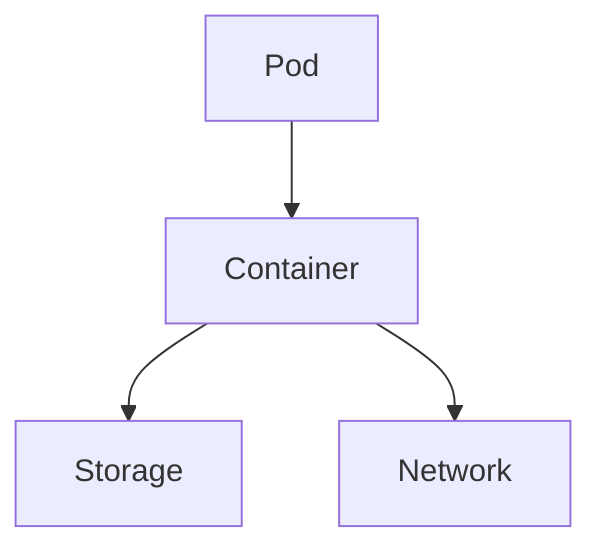
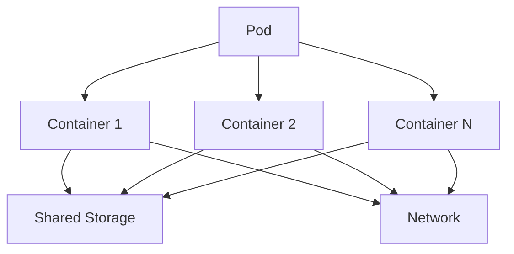

# CKA Certification Course - Certified Kubernetes Administrator
 - CKA prepration: https://learn.kodekloud.com/user/courses/cka-certification-course-certified-kubernetes-administrator
 - CKA Certification link: https://www.cncf.io/certification/cka/

## Core Concepts Section Introduction
## Cluster Architecture

## Master Node
1. etcd cluster
2. kube-scheduler
3. Controller-Manager (node-controller, Replication-Controller)
4. kube-apiserver

## Worker Node
1. kubelet
2. kube-proxy

### ETCD cluster
ETCD is a distributed reliable key-value store that is simple, secure & fast
#### key-value store:
    - Relational databases vs NoSQL: key-value is NoSQL
    - key-value documents
    - Json or Yaml
#### Install ETCD
    - Download Binaries
    - Extract
    - Run ETCD Service
#### Operate ETCD
    - Run ETCD Service: `./etcd'
    - ./etcdctl set key1 value1
    - ./etcdctl get key1
    - Port: 2379
    - ./etcdctl --version -> utitlity version & API version
#### ETCD in kubernetes
    - Everything below is changed in etcd server
    - Nodes, Pods, Configs, Secrets, Accounts, Roles, Bindings, Others
    - Setup: `wget -q --https-only "download_link.tar.gz"
    - Setup - Kubeadm: `kubectl get pods -n kube-system && kubectl exec etcd-master -n kube-system etcdctl get / --prefix -keys-only` (Run insid the etcd-master POD)
    - ETCD in HA (High Availability) Environment, there are multiple etcd servers
#### ETCD Commands
    ```shell
    # version 2
    etcdctl backup
    etcdctl cluster-health
    etcdctl mk
    etcdctl mkdir
    etcdctl set

    # version 3
    etcdctl snapshot save
    etcdctl endpoint health
    etcdctl get
    etcdctl put

    # export etcdctl api of version 3
    export ETCDCTL_API=3

    # etcd certificates
    --cacert /etc/kubernetes/pki/etcd/ca.crt
    --cert /etc/kubernetes/pki/etcd/server.crt
    --key /etc/kubernetes/pki/etcd/server.key

    # final command
    kubectl exec etcd-controlplane -n kube-system -- sh -c "ETCDCTL_API=3 etcdctl get / --prefix --keys-only --limit=10 --cacert /etc/kubernetes/pki/etcd/ca.crt --cert /etc/kubernetes/pki/etcd/server.crt --key /etc/kubernetes/pki/etcd/server.key"
    ```
### kube-scheduler
The kube-scheduler determines which pod goes to which node in the Kubernetes cluster.

#### Key Responsibilities:
    - Evaluates resource requirements of pods.
    - Identifies suitable nodes for pod placement.
    - Ensures balanced resource utilization across the cluster.
    - Adheres to scheduling policies and constraints.

#### Commands and Operations:
```shell
# View the status of the kube-scheduler
kubectl get pods -n kube-system | grep kube-scheduler

# Check logs of the kube-scheduler
kubectl logs -n kube-system kube-scheduler-<pod-name>

# View kube-scheduler configuration
kubectl describe pod kube-scheduler-<pod-name> -n kube-system
```

#### Configuration:
The kube-scheduler can be configured using a policy file or through the Kubernetes API. Common configurations include setting resource priorities, defining custom scheduling policies, and configuring affinity/anti-affinity rules.

```yaml
# Example of a kube-scheduler policy configuration
apiVersion: kubescheduler.config.k8s.io/v1
kind: KubeSchedulerConfiguration
profiles:
    - schedulerName: default-scheduler
        plugins:
            queueSort:
                enabled:
                    - name: PrioritySort
            preFilter:
                enabled:
                    - name: NodeResourcesFit
            filter:
                enabled:
                    - name: NodeUnschedulable
                    - name: NodeName
            score:
                enabled:
                    - name: NodeResourcesBalancedAllocation
```
### Controller-Manager:
#### node-controller
#### Replication - Controller

### Kube-apiserver
primary management component in k8s
```shell
# Creating of pod via post request
curl -X POST /api/v1/namespaces/default/pods ...[other]

# Creating of pod with kubectl command
kubectl create pod name
```
#### Kube-Api Server does the following:
    1. Auth user
    2. Validate request
    3. Retrieve data
    4. Update ETCD
    5. Scheduler
    ```
    # installing kube-api server
    wget https://storage.googleapis.com/kubernetes-release/release/v1.21.0/bin/linux/amd64/kube-apiserver
    kube-apiserver.service

    # view api-server - Kubeadm
    kubectl get pods -n kube-system
    cat /etc/kubernetes/manifests/kube-apiserver.yml
    ps -aux | grep kube-apiserver
    ```

## Worker Node
### kubelet (captain of the ship)
listens for instructions from kube-apiserver
#### Kubelet working
    1. Register Node
    2. Create Pods
    3. Monitor Node & Pods

### kube-proxy
communication, traffic rules
Pod network
ip of the pod <--> Connectivity
service: db (ip10.96.0.12)
service cannot join the pod network (not an actual thing, only lives in kubernetes memory)
kube-proxy: process, look for new service, create appropirate rules for each node, iptable rules

## Docker-vs-ContainerD
Docker: dominant due to user-experience
docker + kubernetes (initially) -> only work with docker
CRI: Container Runtime Interface - OCI Standard (open container initiative -> imagespec, runtimespec) -> anyone can build container runtime

### docker:
Docker doesn't comply with CRI
rkt: supported by CRI
dockershim: temporary way to contiue to support docker for runtime
v1.24: support for docker removed
now docker followed the imagespec
now docker comply with CRI

### ContainerD:
conainerd: CRI compatible
runtime on its own
can work with kubernetes
it is a member of cncf
containerd alone can be used if dont needed docker other functions
CLI - ctr: ctr comes with containerD, not very user friendly, only supports limited features
```shell
ctr
ctr images pull docker.io/library/redis:alpine
ctr run pull docker.io/library/redis:alpine
```
#### ctr utility (containerD):
Only used for de-bugging purposes
dont use it
limited features
not recommended

#### CLI nerdctl (containerD):
provdes a coker-lie cli for containerD
nerdctl supports docker compose
nerdctl supports newest features in containerd
 - Encrypted container images
 - Lazy Pulling
 - P2P image distribution
 - Image signing and verifying
 - Namespaces in kubernetes
```shell
nerdctl
nerdctl run --name redis redis:alpine
nerdctl run --name webserver -p 80:80 -d nginx
```

#### rkt
CRI (container runtime interface)
crictl utility, maintained by k8s community
must be installed separately
debugging tool - special debugging purposes
kubectl is unaware of circtl type of images
```shell
crictl
crictl pull busybox
crictl images
crictl ps -a
crictl exec -i -t 34234345dsfsjklfj ls
crictl logs 3e03423425f1
crictl pods
```

## A note on Docker Deprecation
Why are we still talking about docker if docker is deprecated?
cli, api, build, volumes, auth, security

containerD was removed from docker
docker is still the most popular container solution
**--> k8s no longer require docker as the runtime**
it is ok to use docker as an example

**--> Replace: docker - nerdctl**
## Pods

Pods are the smallest, most basic deployable objects in Kubernetes. A Pod represents a single instance of a running process in your cluster.

### Pod Diagram

#### Single Container Pod


#### Multi-Container Pod


### Key Characteristics of Pods:
- **Multiple Containers**: A Pod can encapsulate one or more containers.
- **Shared Storage**: Containers in a Pod share storage volumes.
- **Shared Network**: Containers in a Pod share an IP address and port space.

### Pod Lifecycle:
1. **Pending**: The Pod has been accepted by the Kubernetes system, but one or more of the container images have not been created.
2. **Running**: The Pod has been bound to a node, and all of the containers have been created.
3. **Succeeded**: All containers in the Pod have terminated successfully.
4. **Failed**: All containers in the Pod have terminated, and at least one container has terminated in failure.
5. **Unknown**: The state of the Pod could not be obtained.

### Commands and Operations:
```shell
# Create a Pod
kubectl run mypod --image=nginx

# List all Pods
kubectl get pods

# Describe a Pod
kubectl describe pod mypod

# Delete a Pod
kubectl delete pod mypod
```

### Example Pod Configuration:
```yaml
apiVersion: v1
kind: Pod
metadata:
  name: mypod
spec:
  containers:
  - name: mycontainer
    image: nginx
    ports:
    - containerPort: 80
```
